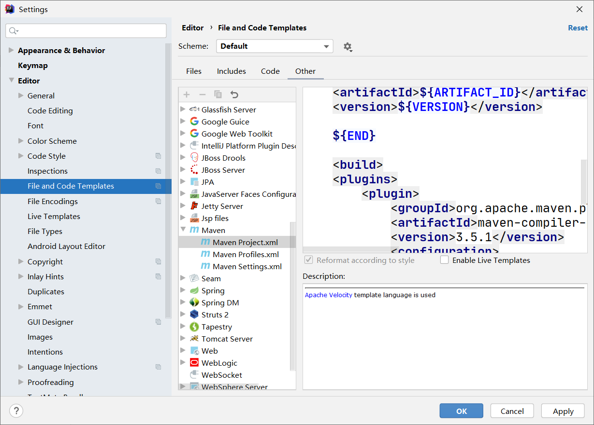

# 解决IDEA自动重置LanguageLevel和JavaCompiler版本的问题

解决办法就是在pom.xml中指定`maven-compiler-plugin`的版本，该版本会同时影响LanguageLevel和JavaCompiler，修改后默认就成了这里设置的版本。

添加下面的配置：

```xml
<build>
    <plugins>
        <plugin>
            <groupId>org.apache.maven.plugins</groupId>
            <artifactId>maven-compiler-plugin</artifactId>
            <version>3.5.1</version>
            <configuration>
                <source>11</source>
                <target>11</target>
            </configuration>
        </plugin>
    </plugins>
</build>
```

## 直接修改 pom.xml 模板

Editor ----> File and Code Templates----> Other ----> Maven ----> Maven Project.xml



## 参考

[解决IDEA自动重置LanguageLevel和JavaCompiler版本的问题](https://blog.csdn.net/isea533/article/details/48575983)

[idea创建maven项目时设置pom.xml文件默认格式的一种方式](https://blog.csdn.net/timexx/article/details/107677736)


